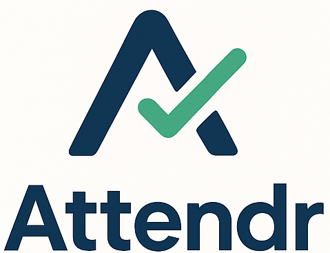
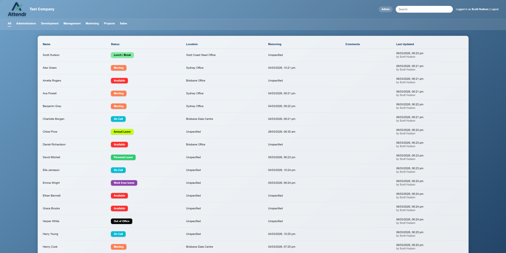
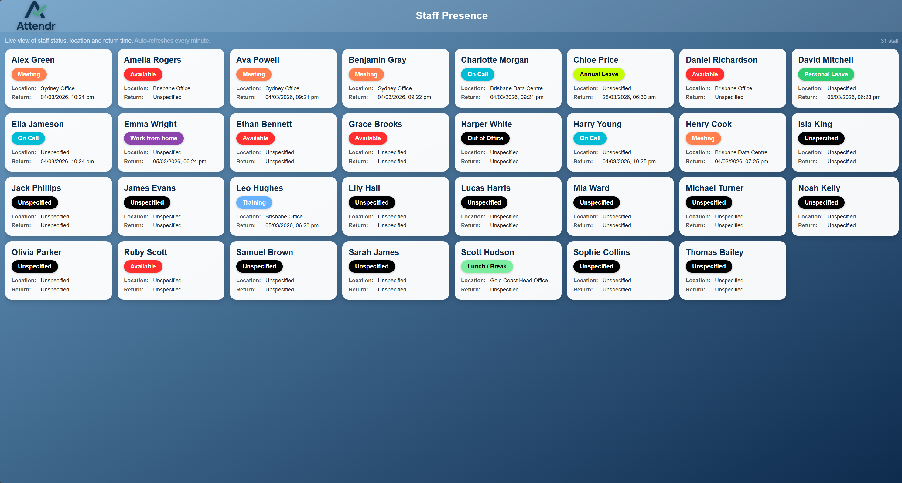
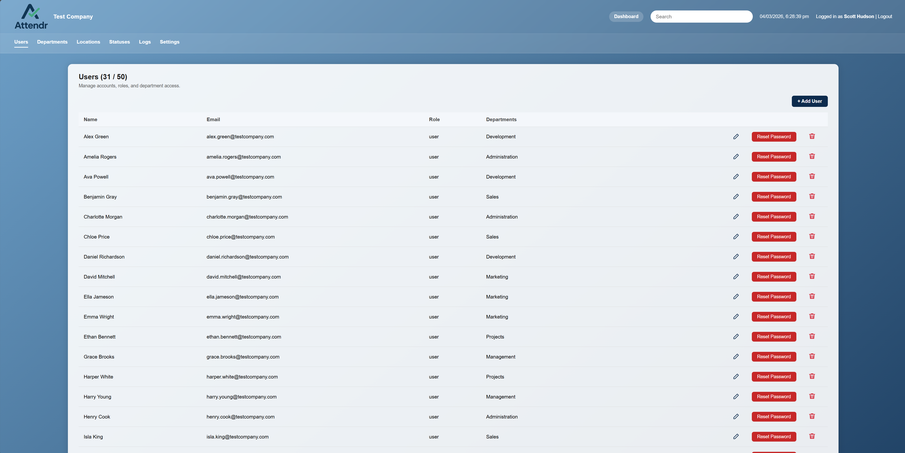
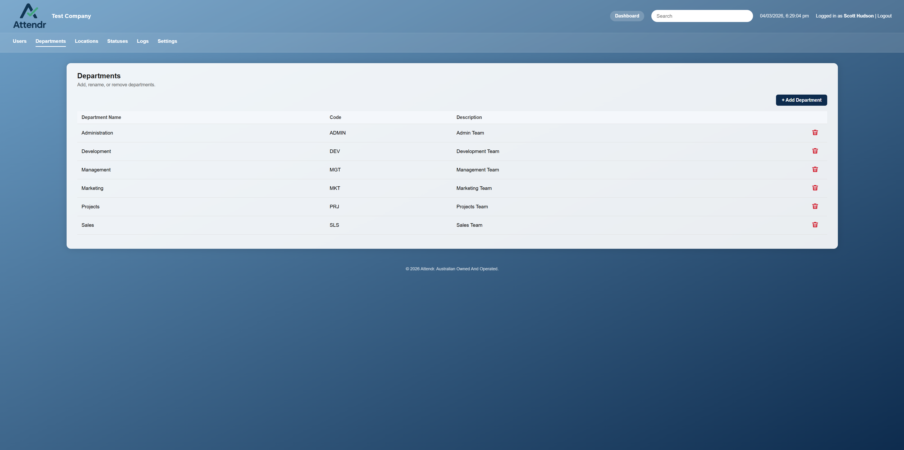
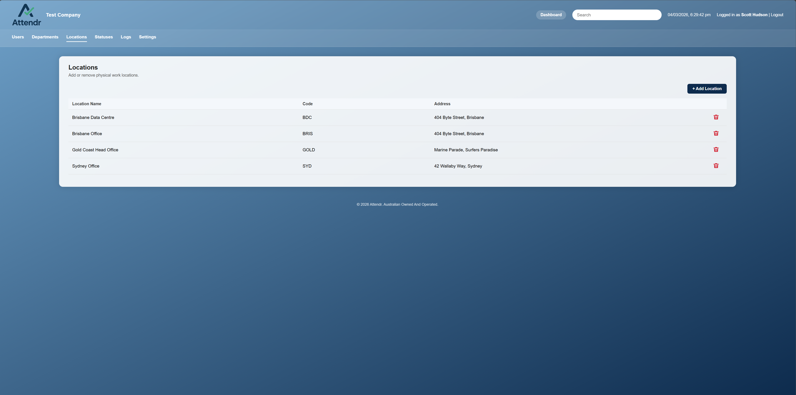
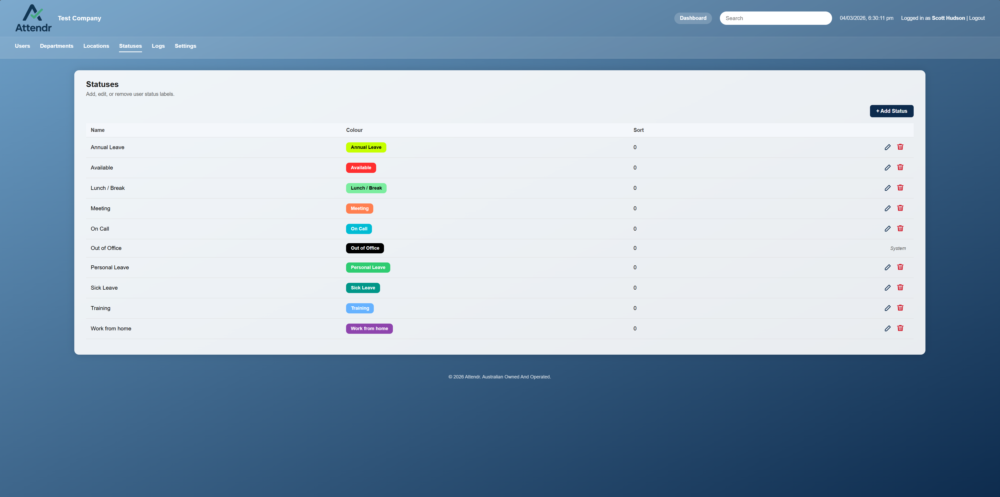
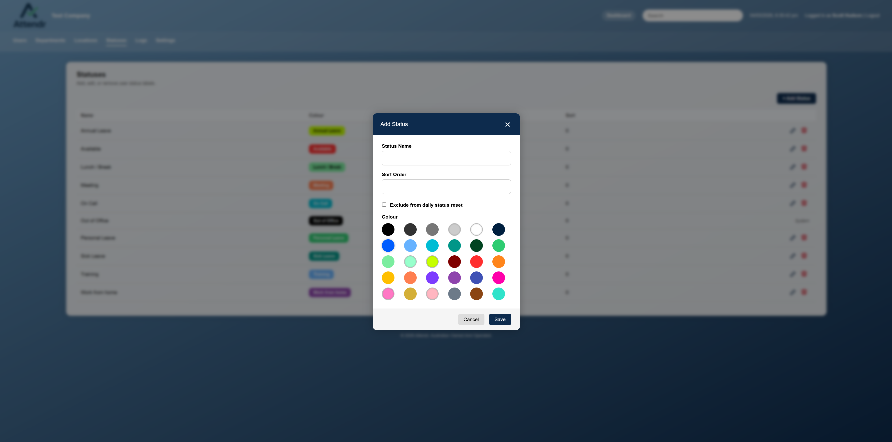
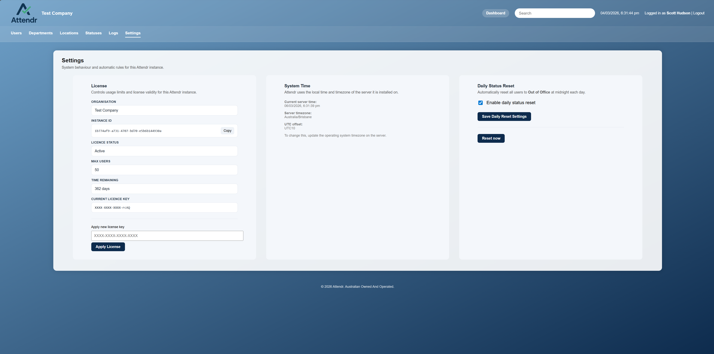
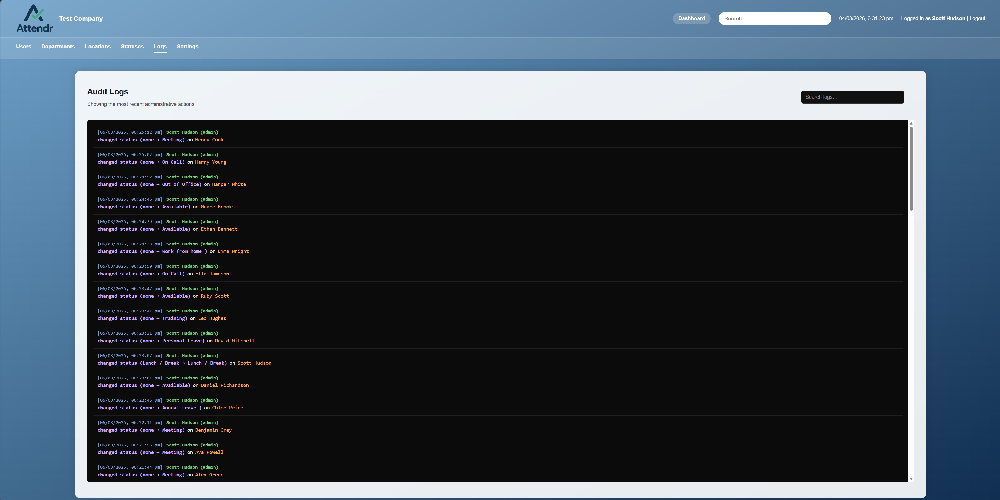

<div align="center">



# Attendr

### Self-hosted staff presence and in/out board software

**Know who's in, who's out, where they are, and when they're returning.**

<br>

[](../../releases/latest)
[](../../releases/latest)
[](https://attendr.com.au)
[](https://attendr.com.au)

<br>

[Website](https://attendr.com.au) •
[Download](../../releases/latest) •
[Documentation](docs/Attendr_v1.0.1_Documentation.pdf) •
[Support](https://attendr.com.au/support.html)

</div>

---

# Staff presence without the complexity

Attendr is a self-hosted staff presence and in/out board application designed to give teams a simple, real-time view of where their people are.

At a glance, see who is:

- In the office
- Working from home
- Out of office
- On leave
- Unavailable
- At another location

Attendr runs on your own Windows server or PC, keeping your workplace data under your control.

---

# Attendr is now free

## Free forever for up to 30 active users

There is no trial countdown and no feature-restricted free edition.

| | Free | Unlimited |
|---|---:|---:|
| Active users | Up to 30 | Unlimited |
| Full platform access | Yes | Yes |
| Subscription | None | None |
| Licence expiry | None | None |
| Price | **A$0** | **A$100 once** |

A licence is only required when you need more than 30 active users.

**One installation. One payment. No ongoing subscription.**

[View Attendr pricing](https://attendr.com.au/pricing.html)

---

# Dashboard



The Attendr dashboard provides a clear, real-time view of staff presence across your organisation.

See:

- Current status
- Current location
- Expected return time
- Comments
- Last updated time
- Department membership

The board can be filtered by department, making it easy for teams to see the people relevant to them.

---

# Kiosk Mode



Attendr includes a dedicated kiosk interface designed for shared devices, reception areas and common spaces.

Staff can quickly update their status without needing to navigate the full application.

Kiosk mode is ideal for:

- Reception desks
- Office entrances
- Shared team areas
- Touchscreen terminals
- Wall-mounted displays

---

# Features

## Real-time staff presence

See the current status of your team from one central dashboard.

## Custom statuses

Create statuses that match the way your organisation works.

Examples include:

- In Office
- Work From Home
- Out of Office
- Sick Leave
- Annual Leave
- Unavailable

## Departments

Organise users into departments such as:

- Executive
- Finance
- Human Resources
- Information Technology
- Marketing
- Operations
- Sales

Users can then filter the main presence board by department.

## Locations

Create multiple workplace locations and associate staff with them.

Attendr also supports **IP-based location detection**, allowing a user's location to be determined automatically based on the network they are connected to.

## User profiles

Users can manage their own:

- Status
- Location
- Expected return
- Comments
- Profile information

## Kiosk mode

Provide a shared interface for staff to quickly mark themselves in, out, remote or unavailable.

## Active Directory integration

Attendr can integrate with Active Directory environments for user synchronisation and authentication.

## Microsoft Entra ID integration

Attendr also supports Microsoft Entra ID for organisations using Microsoft cloud identity services.

## Self-hosted deployment

Attendr runs on your infrastructure.

Your server.

Your network.

Your data.

---

# Administration

Attendr includes a full administration interface for managing the platform.

## User Management



Administrators can create, edit, deactivate and manage Attendr users.

User management includes control over:

- User details
- Departments
- Locations
- Roles
- Authentication
- Account status

---

## Departments



Create and manage departments to reflect your organisational structure.

Departments can be used to group staff and filter the main presence board.

---

## Locations



Locations can represent:

- Offices
- Buildings
- Sites
- Remote locations
- Branches
- Facilities

Attendr can also associate network ranges with locations for automatic IP-based location detection.

---

## Status Management



Statuses can be customised to match your organisation.

Administrators can define:

- Status name
- Display colour
- Availability state
- Behaviour
- Return requirements

### Status selection



Staff can quickly update their current availability using the status selector.

---

## Settings



The Attendr settings interface provides central configuration for the application.

Configuration includes areas such as:

- General settings
- Branding
- Authentication
- Integrations
- Licensing
- Status behaviour
- Application configuration

---

## Audit Logs



Attendr includes audit logging to provide visibility into important administrative and user actions.

Logs can assist with:

- Troubleshooting
- Change tracking
- Administrative auditing
- Operational visibility

---

# Automatic location detection

Attendr can automatically determine a user's physical location based on their network address.

Administrators can associate network ranges with Attendr locations.

For example:

```text
10.10.10.0/24    Head Office
10.10.20.0/24    Warehouse
10.20.10.0/24    Branch Office
